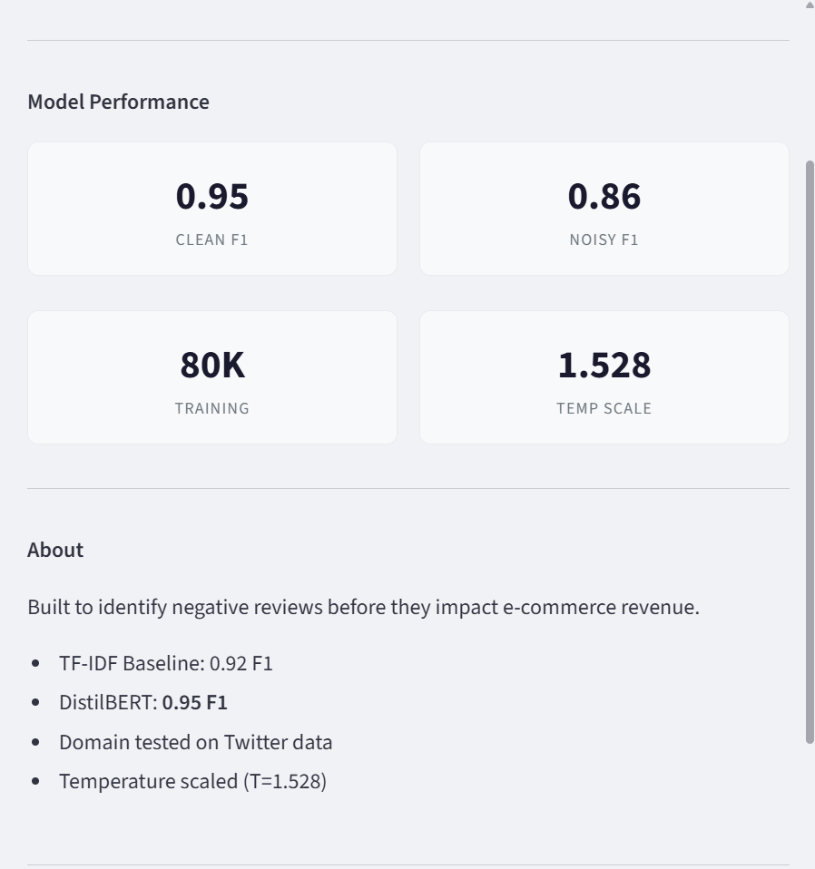
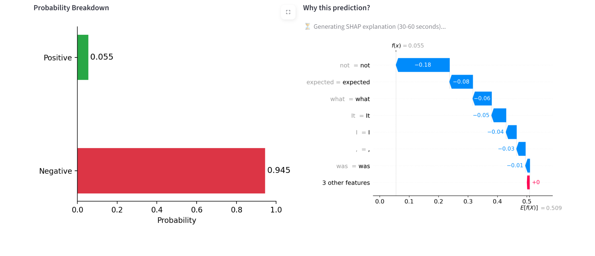
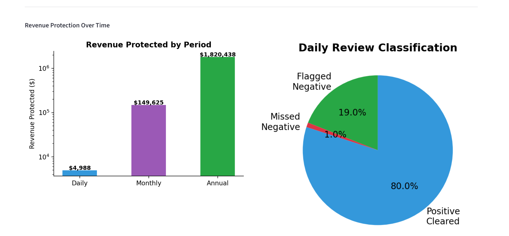
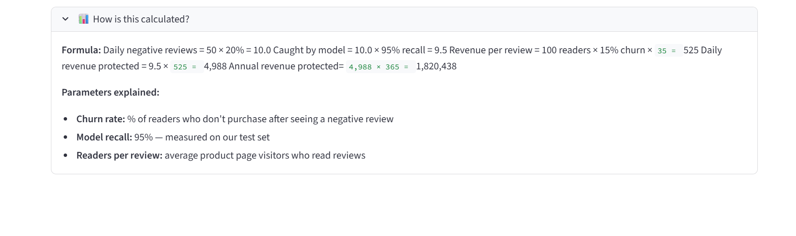

# 🎯 Sentiment Analyzer

**Production-grade NLP system** that classifies product review sentiment using fine-tuned DistilBERT, with SHAP explainability, calibration analysis, domain generalization testing, and an interactive business impact calculator.

🚀 **[Live Demo](https://huggingface.co/spaces/pragya0151/sentiment-analyzer)** · 📓 **[Training Notebook](YOUR_COLAB_LINK)** · 🐙 **[GitHub](https://github.com/pragya20khullar/sentiment-analysis)**

---

## The Problem

E-commerce businesses lose revenue when negative reviews go unaddressed. A single negative review seen by 100 shoppers with a 15% churn rate costs ~$525 in lost sales. At scale, that's millions.

This system flags negative reviews in real time — before they impact purchase decisions.

---

## What Makes This Different

Most sentiment classifiers stop at accuracy. This one doesn't.

| What most projects do | What this project does |
|---|---|
| Train a model, report accuracy | Baseline → fine-tune → stress test → fix calibration |
| Test on clean data only | Domain generalization test on Twitter (different domain, noisy language) |
| Black box predictions | SHAP word-level explanations for every prediction |
| Report F1 score | Identify *why* the model fails (sarcasm, mixed sentiment) |
| No business context | Interactive revenue impact calculator |
| Local notebook | Deployed live on HuggingFace Spaces |

---

## Results

### Model Performance

| Model | Clean F1 | Noisy F1 | Robustness Drop |
|-------|----------|----------|-----------------|
| TF-IDF + Logistic Regression | 0.92 | 0.78 | -14% |
| DistilBERT Fine-tuned | **0.95** | **0.86** | **-9%** |

> DistilBERT maintained significantly higher performance on out-of-domain noisy Twitter data, demonstrating real-world robustness rather than benchmark-only performance.



---

### Calibration

Before temperature scaling, the model showed overconfidence in the 0.3–0.6 probability range — exactly where sarcasm and mixed-sentiment reviews live.

Applied temperature scaling (**T=1.528**) to correct this.

---

### Business Impact

Based on industry estimates:

- Average order value: **$35**
- Review-driven churn: **15%**
- Readers per review: **100**

Estimated:

- **Daily revenue protected:** $4,988
- **Annual revenue protected:** ~$1.82M

*Values are adjustable using the interactive calculator in the live demo.*

---

## Technical Approach

### Why DistilBERT over BERT?

DistilBERT is:

- ~40% smaller
- ~60% faster at inference
- Retains ~97% of BERT performance

For production deployment where inference speed matters, this provides a better engineering tradeoff.

---

### Why Temperature Scaling?

Error analysis revealed overconfidence on ambiguous reviews.

Calibration curve analysis confirmed systematic overconfidence in the 0.3–0.6 confidence range.

Temperature scaling (single learned parameter: **T = 1.528**) corrected this without retraining.

---

### Why Test on Twitter Data?

A model that only works on clean review data isn't production-ready.

Testing on Twitter airline sentiment data introduced:

- abbreviations
- @mentions
- informal language
- sarcasm
- domain shift

This gives a more honest estimate of real-world robustness.

---

## System Architecture



---

## Features

### 🔍 Single Review Analysis

Real-time sentiment prediction with:

- calibrated confidence score
- probability breakdown
- SHAP waterfall explanations
- word-level contribution visualization




---

### 📦 Batch Prediction

Upload CSV → select text column → receive:

- predictions
- confidence scores
- downloadable output

Tested on **14K+ reviews**


---

### 📈 Business Impact Calculator

Interactive calculator with:

- Average order value
- Churn rate
- Readers per review
- Daily reviews
- Negative review %

Provides:

- Daily impact estimate
- Annual impact estimate
- Formula breakdown





---

## Error Analysis

Manual inspection of failures revealed three recurring patterns:

### 1. Mixed sentiment

Example:

> "I love the brand but this product disappointed me"

### 2. Sarcasm

Example:

> "Definitely not a roast for the weak"

### 3. Subtle disappointment

Example:

> "It was okay I guess, not what I expected"

These same examples corresponded with calibration uncertainty, confirming consistency between confidence estimates and prediction failures.

---

## Tech Stack

| Layer | Technology |
|---------|------------|
| Model | DistilBERT (66M parameters) |
| Framework | PyTorch + HuggingFace Transformers |
| Explainability | SHAP |
| Calibration | Temperature Scaling |
| Frontend | Streamlit |
| Deployment | HuggingFace Spaces |
| Training | Google Colab T4 GPU (~35 min) |

---

## How to Run Locally

```bash
git clone https://github.com/pragya0151/sentiment-analysis.git
cd sentiment-analysis

pip install -r requirements.txt

python download_model.py

streamlit run app.py
```

---

## Dataset

### Training Dataset

**Amazon Fine Food Reviews**

- Original dataset: 568K reviews
- Used: 80K balanced samples
- 40K positive
- 40K negative

### Generalization Dataset

**Twitter US Airline Sentiment**

- 4,726 balanced samples
- Different domain
- Zero overlap with training data

---

## Known Limitations

- Struggles with sarcasm
- Struggles with mixed sentiment
- Training data from 1999–2012
- Periodic retraining recommended
- ~9% performance drop on out-of-domain data

---

## Future Work

- Multi-class sentiment (positive/neutral/negative)
- Sarcasm detection
- Data drift monitoring
- Domain-specific fine-tuning

---

Built by **Pragya Khullar**  
B.Tech ECE-AI, IGDTUW (2026)

[LinkedIn](https://linkedin.com/in/pragya-khullar-58597125b)