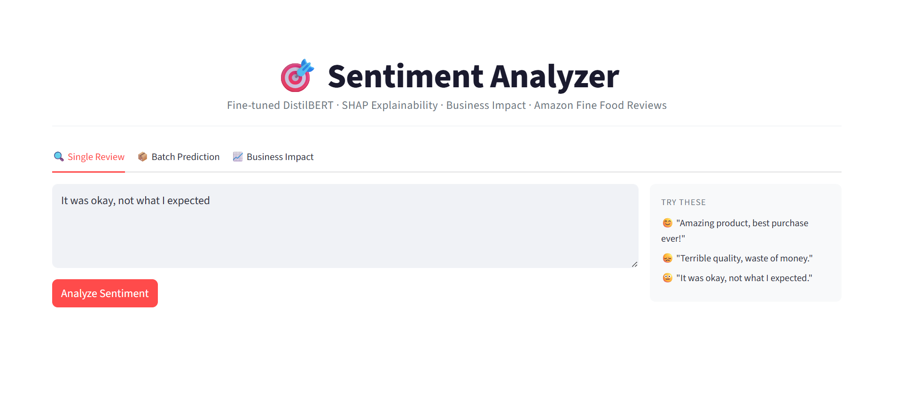
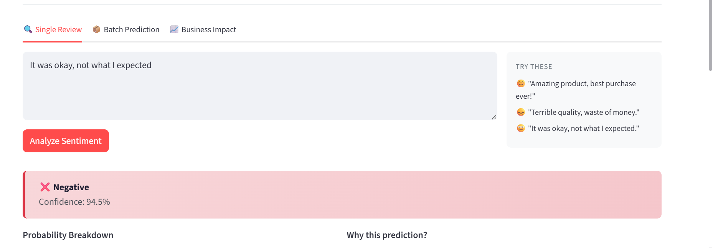
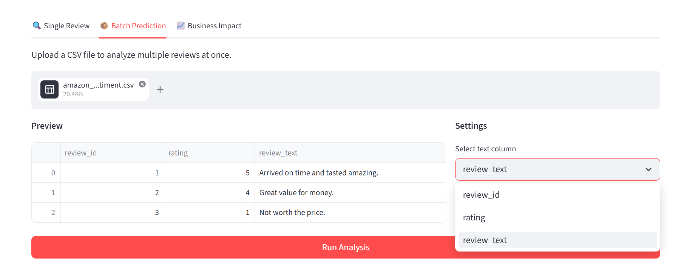
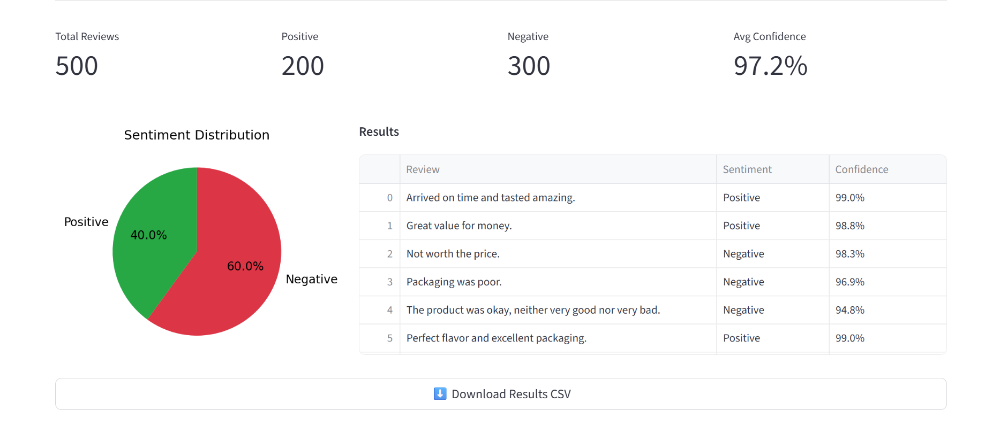
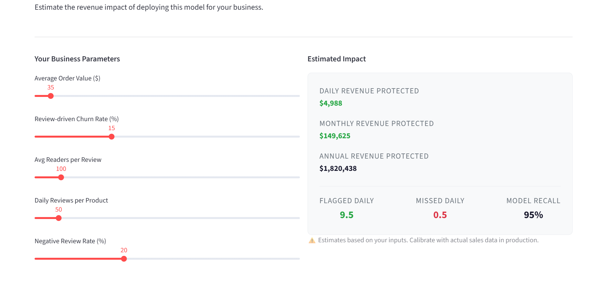

# 🎯 Sentiment Analyzer

**Production-grade NLP system** that classifies product review sentiment using fine-tuned DistilBERT, with SHAP explainability, calibration analysis, domain generalization testing, and an interactive business impact calculator.

🚀 **[Live Demo](https://huggingface.co/spaces/pragya0151/sentiment-analyzer)** · 📓 **[Training Notebook](YOUR_COLAB_LINK)** · 🐙 **[GitHub](https://github.com/pragya20khullar/sentiment-analysis)**

---

## The Problem

E-commerce businesses lose revenue when negative reviews go unaddressed. A single negative review seen by 100 shoppers with a 15% churn rate costs ~$525 in lost sales. At scale, that's millions. This system flags negative reviews in real time — before they impact purchase decisions.

---

## What Makes This Different

Most sentiment classifiers stop at accuracy. This one doesn't.

| What most projects do | What this project does |
|---|---|
| Train a model, report accuracy | Baseline → fine-tune → stress test → fix calibration |
| Test on clean data only | Domain generalization test on Twitter (different domain, noisy language) |
| Black box predictions | SHAP word-level explanations for every prediction |
| Report F1 score | Identify *why* the model fails (sarcasm, mixed sentiment) |
| No business context | Interactive revenue impact calculator |
| Local notebook | Deployed live on HuggingFace Spaces |

---

## Results

### Model Performance

| Model | Clean F1 | Noisy F1 | Robustness Drop |
|-------|----------|----------|-----------------|
| TF-IDF + Logistic Regression | 0.92 | 0.78 | **-14%** |
| DistilBERT Fine-tuned | **0.95** | **0.86** | **-9%** |

> DistilBERT maintained significantly higher performance on out-of-domain noisy Twitter data — demonstrating real-world robustness, not just benchmark performance.


### Calibration

Before temperature scaling, the model showed overconfidence in the 0.3–0.6 probability range — exactly where sarcasm and mixed-sentiment reviews live. Applied temperature scaling (T=1.528) to correct this.

### Business Impact

Based on industry estimates ($35 avg order, 15% review-driven churn, 100 readers/review):
- **Daily revenue protected:** $4,988
- **Annual revenue protected:** ~$1.82M
- *Parameters adjustable via interactive calculator in the live demo*

---

## Technical Approach

### Why DistilBERT over BERT?
40% smaller, 60% faster at inference, retains 97% of BERT's performance. For a production deployment where inference speed matters, this tradeoff is the right engineering decision.

### Why temperature scaling?
Error analysis revealed the model was overconfident on ambiguous reviews. Calibration curve analysis confirmed systematic overconfidence in the 0.3–0.6 range. Temperature scaling (a single learned parameter T=1.528) corrected this without retraining — a standard production MLOps technique.

### Why test on Twitter data?
A model that only works on clean, well-written reviews isn't production-ready. Testing on Twitter airline sentiment (different domain, @mentions, abbreviations, sarcasm) gave an honest measure of real-world robustness — not just benchmark performance.

---

## System Architecture


---

## Features

**🔍 Single Review Analysis**
Real-time sentiment prediction with calibrated confidence score, probability breakdown, and SHAP waterfall explanation showing word-level contributions.





**📦 Batch Prediction**
Upload any CSV → select text column → get predictions + confidence scores for every row → download results. Tested on 14K+ reviews.




**📈 Business Impact Calculator**
5 adjustable parameters (order value, churn rate, readers/review, daily reviews, negative rate) → real-time revenue impact estimate → transparent formula breakdown.




---

## Error Analysis

Manual inspection of misclassified reviews revealed three systematic failure modes:

1. **Mixed sentiment** — reviews that start positive and turn negative ("I love the brand but this product disappointed me")
2. **Sarcasm** — indirect negativity without explicit negative words ("Definitely not a roast for the weak")  
3. **Subtle disappointment** — dissatisfaction without strong negative vocabulary ("It was okay I guess, not what I expected")

> These are the same cases where the calibration curve showed overconfidence — confirming that model uncertainty and error patterns are consistent.

---

## Tech Stack

| Layer | Technology |
|-------|-----------|
| Model | DistilBERT (distilbert-base-uncased, 66M params) |
| Framework | PyTorch + HuggingFace Transformers |
| Explainability | SHAP (PartitionExplainer) |
| Calibration | Temperature Scaling (post-hoc) |
| Frontend | Streamlit |
| Deployment | HuggingFace Spaces |
| Training | Google Colab T4 GPU (~35 mins) |

---

## How to Run Locally

```bash
git clone https://github.com/pragya0151/sentiment-analysis.git
cd sentiment-analysis
pip install -r requirements.txt
python download_model.py
streamlit run app.py
```

---

## Dataset

- **Training:** [Amazon Fine Food Reviews](https://www.kaggle.com/datasets/snap/amazon-fine-food-reviews) — 80K balanced samples (40K positive, 40K negative) from 568K total
- **Generalization test:** [Twitter US Airline Sentiment](https://www.kaggle.com/datasets/crowdflower/twitter-airline-sentiment) — 4,726 balanced samples, zero overlap with training data

---

## Known Limitations

- Struggles with sarcasm and mixed-sentiment reviews (identified via error analysis)
- Trained on 1999–2012 data — periodic retraining recommended for drift
- 9% F1 drop on out-of-domain Twitter data — domain-specific fine-tuning would improve this

---

## Future Work

- 3-class classification (positive/neutral/negative)
- Sarcasm detection via adversarial training examples
- Automated data drift monitoring
- Domain-specific fine-tuning for electronics, fashion, services

---

*Built by Pragya Khullar · B.Tech ECE-AI, IGDTUW (2026) · [LinkedIn](https://linkedin.com/in/pragya-khullar-58597125b)*